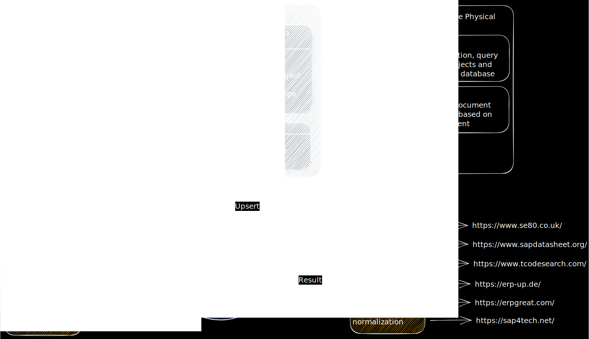

# sap-assistant
SAP Assistant is an assistance system to help with tasks around SAP R/3 systems.

# Current Roadmap
Current target: v0.2
This target should include:
- scraping sources
- archiving scraping results

v0.1
- basic documentation and planning
- setting up basic structure

# Current Architecture
